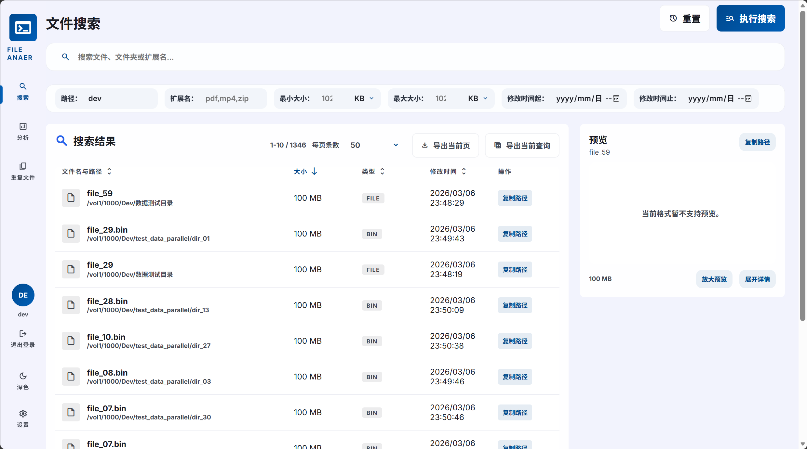
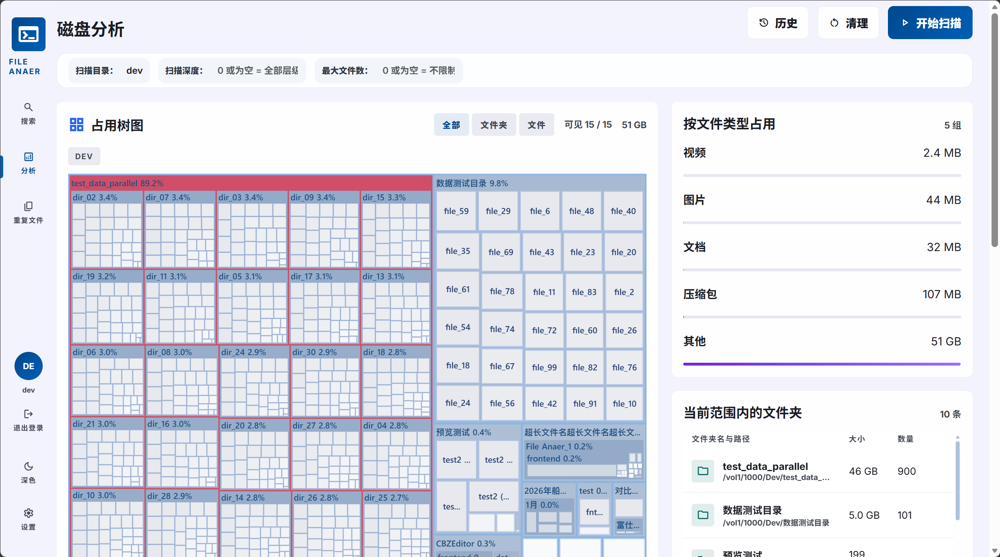
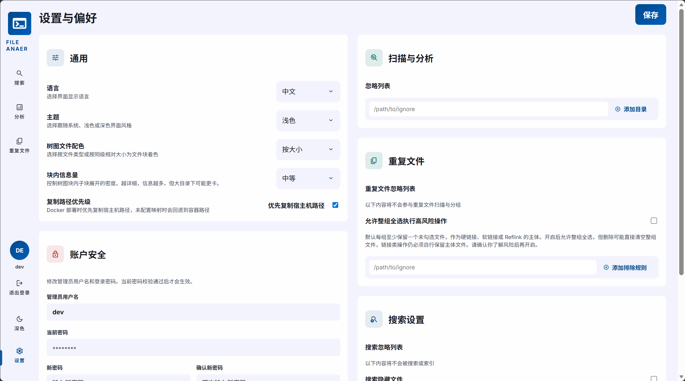

# File Anaer

`File Anaer` 是一个面向内网、自托管和 NAS 场景的文件分析 Web 应用，核心能力是：

- 磁盘占用分析
- 文件搜索
- 重复文件扫描与处理
- 常见文件预览

项目默认通过 Docker 部署，后端使用 Go，前端使用 React + Vite。

## 友链

- [LINUX DO](https://linux.do)

## 功能概览

### 磁盘分析

- 基于 `gdu` 的目录体积分析
- treemap 可视化
- 最大文件列表
- 文件类型占用统计
- 分析历史记录
- 最大文件列表右侧预览与放大预览

### 文件搜索

- 基于 `fd` 的快速搜索
- 支持名称、扩展名、大小、时间等筛选
- 支持多扫描根目录
- 名称排序使用自然排序，避免 `1, 10, 11, 2`
- 右侧预览面板与放大预览弹窗
- 支持导出当前页和当前查询

### 重复文件

- 基于 `fclones` 的重复文件扫描
- 支持扫描目录、目录对目录、文件对目录
- 支持删除、副本保留、硬链接、软链接、reflink、重命名
- 支持历史记录、刷新列表状态、操作日志
- 右侧预览面板与放大预览弹窗

## 预览支持

### 浏览器原生预览

- 图片：`jpg` `jpeg` `png` `gif` `webp` `svg` `bmp` `avif` `ico` `jfif`
- 音频：`mp3` `wav` `ogg` `opus` `m4a` `aac` `flac`
- 视频：`mp4` `mov` `mkv` `avi` `webm` `m4v`
- 尝试支持：`ogv` `mpeg` `mpg` `3gp`
- PDF：`pdf`

说明：

- 媒体格式能否直接播放，最终取决于浏览器自身的解码支持。

### 文本预览

- 常见文本、源码、配置、日志、字幕格式
- Markdown 渲染：`md` `markdown`
- 额外支持：`ndjson` `tsv` `c` `cc` `cpp` `h` `hpp` `vue` `lua` `rb` `php` `kt` `kts` `swift`
- 按文件名识别：`Dockerfile` `Makefile` `.gitignore`

### 文档与归档预览

- 文档文本抽取：`docx` `xlsx` `pptx` `odt` `ods` `odp` `epub`
- 归档目录预览：`zip` `7z` `tar` `tgz` `tar.gz`
- 漫画包首图预览：`cbz` `cb7`

### 明确不支持预览

- 老式二进制 `wps`
- 老式 `doc` `xls` `ppt`
- Office 临时锁文件，例如 `~$name.docx`

说明：

- 不支持的格式会明确显示“当前格式暂不支持预览”，不会再回退成乱码。
- 文档类预览以可读性优先，不追求原始版式还原。

## 界面截图

### 搜索页



### 分析页



### 重复文件页


### 设置页



## 技术栈

- 后端：Go
- 前端：React + Vite
- 运行方式：Docker / Docker Compose
- 外部工具：`gdu` `fd` `fclones`

## 第三方工具与许可

运行镜像会包含以下第三方命令行工具：

- `fd`：双许可证 `MIT` / `Apache-2.0`
- `gdu`：`MIT`
- `fclones`：`MIT`

仓库内已提供第三方许可说明与许可证文本：

- `THIRD_PARTY_NOTICES.md`
- `licenses/MIT.txt`
- `licenses/Apache-2.0.txt`

Docker 镜像内也会一并包含这些文件，路径为 `/app/licenses/`。

## 项目结构

- `backend/`：Go 后端与 API
- `frontend/`：前端页面与组件
- `docs/screenshots/`：README 截图
- `.env.example`：环境变量示例
- `docker-compose.yml`：本地和服务器部署模板
- `Dockerfile`：镜像构建文件

## 快速开始

### Docker Compose

先复制环境变量模板：

```bash
cp .env.example .env
```

按你的实际目录修改 `.env` 和 `docker-compose.yml` 中的挂载路径，然后启动：

```bash
docker compose up -d --build
```

默认访问地址：

```text
http://<你的主机>:8080
```

### 直接运行镜像

```bash
docker build -t file-anaer .
docker run --rm -p 8080:8080 -e SCAN_ROOTS=/data -v /path/to/scan:/data:ro file-anaer
```

## 镜像构建与发布

### 本地单架构构建

如果你只是给当前机器使用，直接构建当前架构镜像即可：

```bash
docker build -t file-anaer:local .
```

构建完成后可直接运行：

```bash
docker run --rm -p 8080:8080 file-anaer:local
```

### 本地多架构构建

当前 `Dockerfile` 已经按多阶段和 `TARGETARCH` 写好，可以直接配合 `docker buildx` 做跨架构构建。

先确认 buildx 可用：

```bash
docker buildx version
```

首次使用时建议创建一个 builder：

```bash
docker buildx create --name file-anaer-builder --use
docker buildx inspect --bootstrap
```

如果你在 Linux 上做跨架构构建，通常还需要提前安装 QEMU；Docker Desktop 一般已经带好了。

构建 `linux/amd64` 和 `linux/arm64` 多架构镜像并直接推送：

```bash
docker buildx build \
  --platform linux/amd64,linux/arm64 \
  -t <你的DockerHub用户名>/file-anaer:latest \
  --push .
```

说明：

- 多架构镜像不能像普通 `docker build` 那样天然出现在本地镜像列表里。
- 如果你只是想测试单个平台并加载到本地 Docker，可用 `--load`，但 `--load` 一次只适合单架构。

例如：

```bash
docker buildx build \
  --platform linux/amd64 \
  -t file-anaer:test \
  --load .
```

## 环境变量

关键环境变量如下：

- `SCAN_ROOTS`
  容器内允许扫描的根目录，多个目录用逗号分隔。
- `HOST_PATH_MAPS`
  容器路径到宿主机路径的映射，用于复制路径时优先返回宿主机路径。
- `CMD_TIMEOUT`
  后端调用外部工具的超时时间。
- `MAX_RESULTS`
  服务端搜索结果上限，默认 `50000`。
- `AUTH_STATE_FILE`
  认证状态文件路径，默认 `/app/data/auth.json`。
- `SESSION_COOKIE_SECURE`
  是否仅在 HTTPS 下发送会话 Cookie。
- `SESSION_LIFETIME`
  会话绝对生命周期。
- `SESSION_IDLE_TIMEOUT`
  会话空闲超时。
- `AUTH_USERNAME`
  固定管理员用户名。
- `AUTH_PASSWORD_HASH`
  固定管理员密码的 bcrypt 哈希。

## 登录与认证

应用内置管理员登录，使用服务端 Session。

默认流程：

1. 首次启动后进入初始化页面。
2. 在页面中创建管理员用户名和密码。
3. 后端仅保存 bcrypt 哈希，不保存明文密码。

如果设置了 `AUTH_USERNAME` 和 `AUTH_PASSWORD_HASH`，会跳过首次初始化。

## 忘记密码恢复

当前没有“忘记密码”页面，可以通过两种方式恢复：

1. 通过 `AUTH_USERNAME` 和 `AUTH_PASSWORD_HASH` 覆盖固定凭据。
2. 删除 `AUTH_STATE_FILE` 指向的认证状态文件后重启，重新初始化管理员账号。

## HTTPS 与反向代理

### 纯内网 HTTP

如果你只在内网使用，直接访问：

```text
http://你的主机:8080
```

此时 `SESSION_COOKIE_SECURE` 应保持 `false`。

### 反向代理 HTTPS

推荐部署方式：

```text
浏览器 -> HTTPS 反代 -> File Anaer HTTP 服务
```

此时建议设置：

```env
SESSION_COOKIE_SECURE=true
```

README 不再内置长篇反代模板；如果你使用 Nginx、Caddy 或其他代理，按各自标准反代到容器即可。

## 开发与构建

### 后端

```bash
cd backend
go test ./...
go build ./...
```

### 前端

```bash
cd frontend
npm install
npm run build
```

## 说明与限制

- 生产目标是 Linux / Docker，自带镜像会包含 `gdu`、`fd`、`fclones`。
- 某些媒体格式在不同浏览器里的可播放性可能不一致。
- 旧版 Office / WPS 二进制格式当前不做复杂兼容，统一按不支持预览处理。
